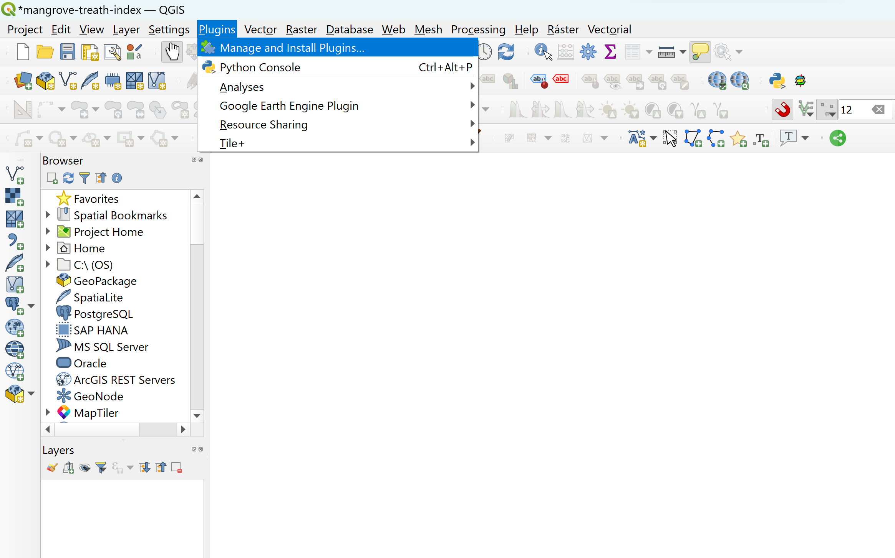
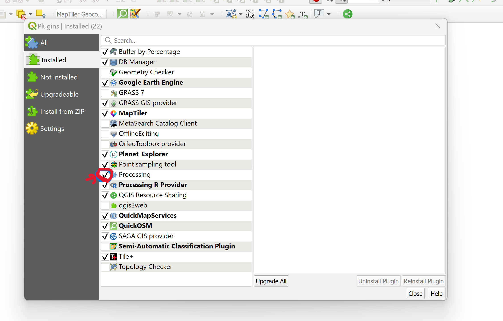
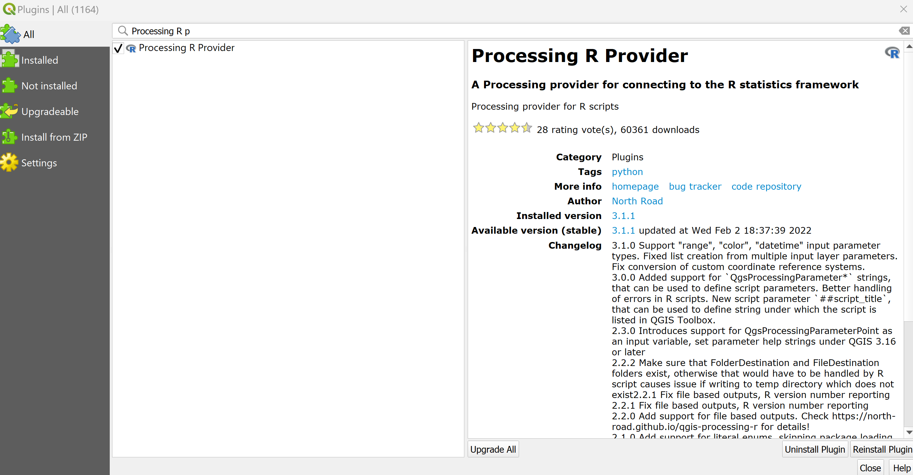
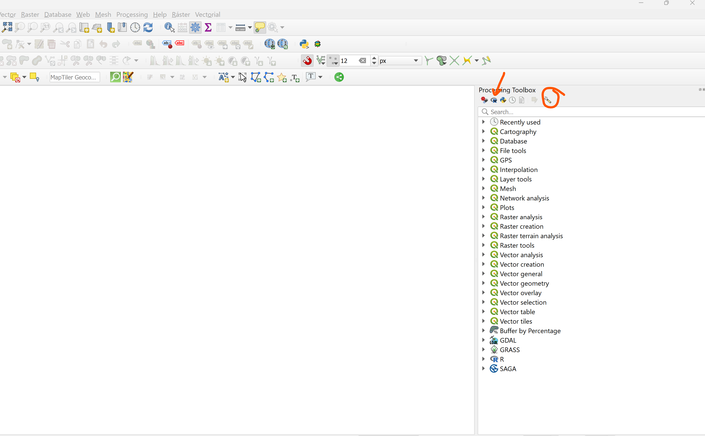
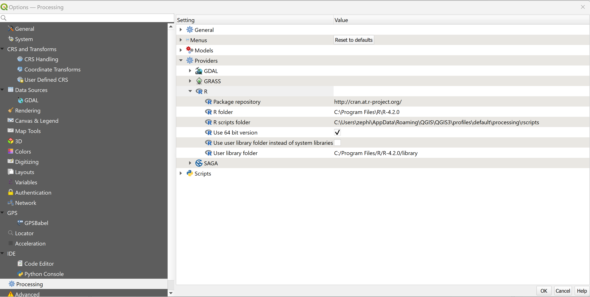
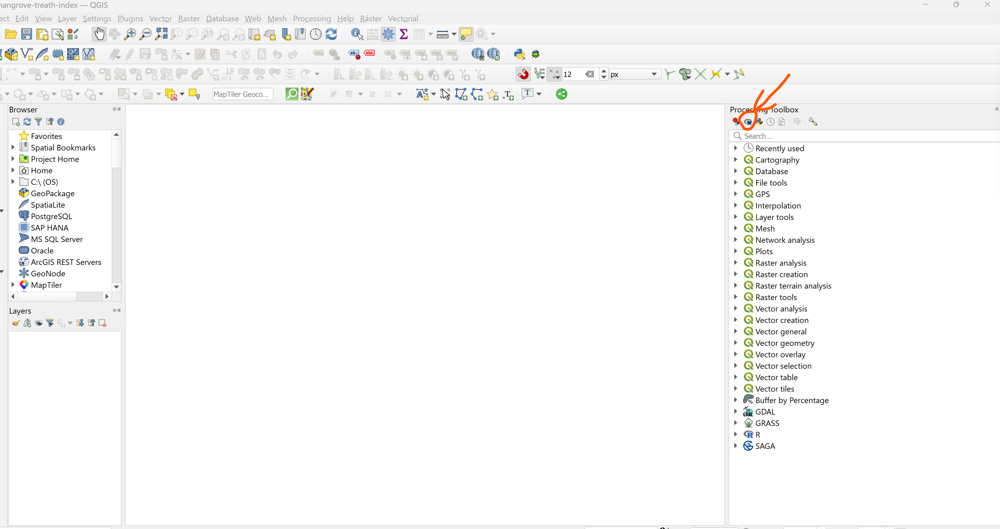
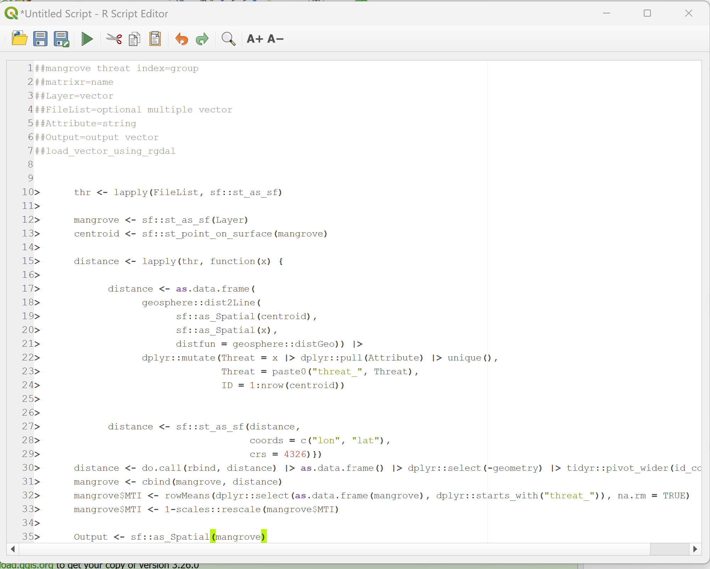
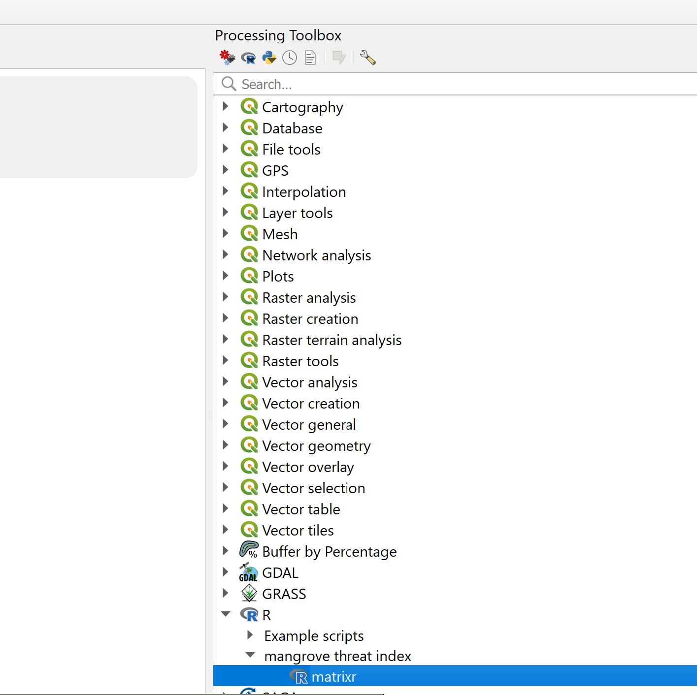
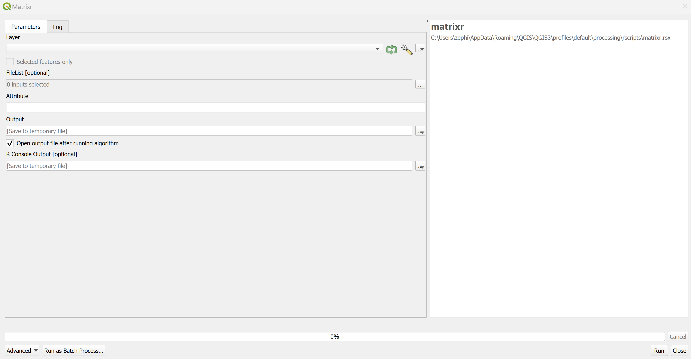

<!-- README.md is generated from README.Rmd. Please edit that file -->

```{r, include = FALSE}
knitr::opts_chunk$set(
  collapse = TRUE,
  comment = "#>",
  fig.path = "man/figures/README-",
  out.width = "100%"
)
```

# matrixr

<!-- badges: start -->

<https://img.shields.io/github/followers/fabbiologia?style=social>

<!-- badges: end -->

The goal of matrixr is to provide an interactive and simple tool to assess and generate data about mangrove conservation status and raise awareness for their conservation.

## Prerequisites

This package is a bridge between R and QGIS that allows users to install all needed dependencies with no issues. All analysis is then made in QGIS. To install the user must have:

1.  Installed version (\>4.0) of R with RStudio (optional)
2.  Installed version (\>3.0) of QGIS

## Installation steps

First, you should open R or Rstudio and install the development version of matrixr from [GitHub](https://github.com/) with:

``` r
install.packages("devtools")
devtools::install_github("CBMC-GCMP/matrixr")
```

Now that the package is installed, you should open QGIS and set some things.

### QGIS preparation

Open QGIS and then click on Plugins -\> Manage and Install Plugins...



Then, from the Manager, you should activate the `Processing` plugin if it is not already.



Now, click on the "All" tab on the left and search for `Processing R Provider` plugin.



After having all installed, the `Processing` menu option should be now visible. Click on it and then go to `Toolbox`.

You should see an `R` logo if all the installation of the processing tools was successful. Now click on the tool icon to open the options.



Check that your options are the same as mine. Specifically, the User library folder, which should be a default.



If you are using MacOS the folder path is different. To know which folder path is the one you should use, you can go in `R` and run the `.Library` command in the console. You can copy paste that path in QGIS.

### R script in QGIS

The R script ported to QGIS is stored in the GitHub repository under the `QGIS` folder, you can copy it from [here](https://raw.githubusercontent.com/CBMC-GCMP/matrixr/main/QGIS/matrixr.rsx). Just copy the text and go back to QGIS.

In QGIS click on create new script in the Processing Toolbox.



In the new window just paste the text you copied to look like so:



Now, just save the script clicking the floppy icon above, save it as `matrixr`.

You should find the tool within the R subfolder in the Processing Tool:



This is how it should look like:



In the `Layer` you should put the mangrove habitat polygon file, you can add directly if open in QGIS, you can draw it and load it, or you can find an existing one by clicking on the points at the end of the line and click on Browse file.

Under Threats you should select all the threats polygon or points vectors you designed or you have existing in your computer. Each of the Threats file should have a column attribute with an identifier of the threat, e.g. a name like "aquaculture". This will be used to calculate the scores per each threat.

You now can run the tool, the Output should show up in the map. From there you can save it.
